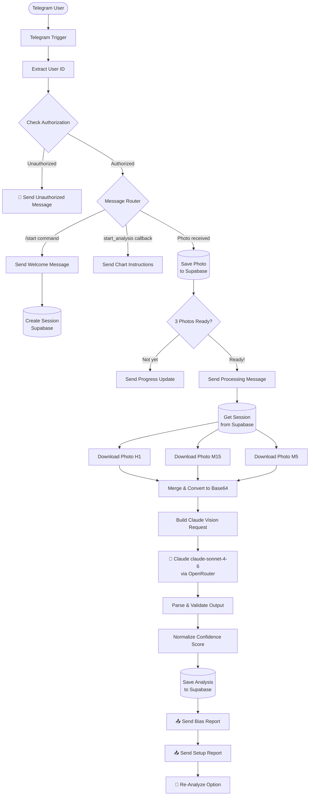

<div align="center">

# 🤖 Trading Holic — AI Forex Chart Analyst Bot

**Kirim screenshot chart kamu. Dapat analisa SMC/ICT lengkap dalam detik.**

[](https://t.me/TradingHolicbot)
[](https://anthropic.com)
[](https://n8n.io)
[](https://supabase.com)
[](https://t.me/YOUR_BOT_LINK)

<br/>

> *"Analisa chart yang biasanya butuh 20–30 menit, sekarang selesai dalam 10 detik."*

</div>

---

## 💡 Latar Belakang

Saat belajar trading forex, salah satu bagian paling time-consuming adalah **analisa chart secara manual**.

Untuk satu setup yang solid, seorang trader perlu:
- Membuka **3 timeframe berbeda** (H1, M15, M5)
- Mengidentifikasi **bias pasar** berdasarkan market structure
- Mencari **area supply/demand** yang relevan
- Mengkonfirmasi **confluence** dari berbagai faktor (liquidity, fibonacci, momentum)
- Menghitung **entry zone, SL, dan TP** secara presisi

Proses ini bisa makan waktu 20–30 menit per pair, dan hasilnya tetap subjektif tergantung skill dan pengalaman si trader.

**Problem yang ingin diselesaikan:** Bagaimana kalau ada asisten AI yang bisa membaca chart seperti seorang trader berpengalaman — langsung, akurat, dan konsisten?

---

## 🚀 Solusi: Trading Holic Bot

Trading Holic adalah **Telegram bot berbasis AI Vision** yang menganalisa chart forex menggunakan metodologi **SMC (Smart Money Concept) / ICT** secara otomatis.

User cukup **kirim 3 screenshot chart** (H1 + M15 + M5) → bot akan memproses semuanya secara paralel → dan memberikan analisa lengkap termasuk bias, entry zone, SL, TP, risk/reward ratio, dan confidence score — **dalam hitungan detik**.

---

## ✨ Fitur Utama

| Fitur | Keterangan |
|---|---|
| 🧠 **AI Vision Multi-Timeframe** | Analisa simultan 3 chart (H1, M15, M5) menggunakan Claude claude-sonnet-4-6 |
| 📊 **Bias Detection** | Identifikasi arah pasar (BUY/SELL) + valid level + market state |
| 🎯 **Entry & Risk Management** | Entry zone, SL price/pips, TP1/TP2/TP3 dengan Risk:Reward ratio |
| ✅ **Confluence Scoring** | Cek 5 faktor: Market Structure, Supply/Demand, Liquidity, Fibonacci, Momentum |
| ⭐ **Confidence Validation** | Scoring system dengan normalisasi algoritmik — bukan sekedar nilai mentah dari AI |
| 🔄 **Session Management** | Tiap user punya sesi aktif yang tersimpan di database |
| 🔐 **Authorization Layer** | Sistem whitelist untuk akses kontrol |
| 🔁 **Re-analysis Option** | User bisa trigger ulang analisa tanpa restart dari awal |

---

## 🔄 Cara Kerja

```
User                    Bot                         AI Engine
 │                       │                              │
 │──── /start ──────────▶│                              │
 │◀─── Welcome + Button ─│                              │
 │                        │                              │
 │──── [Analisa Market] ─▶│                              │
 │◀─── Instruksi 3 Chart ─│                              │
 │                        │                              │
 │──── Screenshot H1 ────▶│─── Save to Supabase ────────│
 │──── Screenshot M15 ───▶│─── Save to Supabase ────────│
 │──── Screenshot M5 ────▶│─── Trigger Analysis ────────│
 │                        │                              │
 │                        │─── Download 3 Photos ───────│
 │                        │    (parallel fetch)          │
 │                        │                              │
 │                        │─── Convert to Base64 ───────│
 │                        │─── Build Vision Prompt ─────│
 │                        │─── Call Claude Vision API ──▶│
 │                        │                              │
 │                        │◀── JSON Analysis Result ─────│
 │                        │─── Validate & Normalize ─────│
 │                        │─── Save to Supabase ─────────│
 │                        │                              │
 │◀─── Bias Report ───────│                              │
 │◀─── Setup Report ──────│                              │
 │◀─── [Re-Analyze] ──────│                              │
```

---

## 🏗️ Arsitektur Sistem



---

## 📤 Contoh Output Analisa

Setelah user mengirim 3 chart, bot akan mengirimkan 2 pesan terstruktur:

**Pesan 1 — Bias & Market State:**
```
📊 BIAS & MARKET STATE
🎯 Direction: BUY
🔍 Valid Above: 1.08450
🌊 Market State: Trending Up
```

**Pesan 2 — Setup Lengkap:**
```
🎯 SETUP BUY
🔥 Entry Zone: 1.08420-1.08460
🛑 Stop Loss: 1.08200 (22 pips)

💰 Take Profit:
  - TP1: 1.08680 (22 pips) - RR 1:1
  - TP2: 1.08900 (45 pips) - RR 1:2
  - TP3: 1.09120 (67 pips) - RR 1:3

⭐ Confidence: ⭐⭐⭐⭐ (82%)

✅ Confluence: 4/5
✔ Market Structure
✔ Supply/Demand
✔ Liquidity
✔ Momentum
```

---

## 🛠️ Tech Stack

| Layer | Teknologi | Fungsi |
|---|---|---|
| **Workflow Engine** | n8n (self-hosted) | Orkestrasi seluruh pipeline |
| **Bot Interface** | Telegram Bot API | User interaction layer |
| **AI Vision** | Claude claude-sonnet-4-6 via OpenRouter | Analisa chart multi-timeframe |
| **Database** | Supabase (PostgreSQL) | Session, foto, dan hasil analisa |
| **Infrastructure** | Oracle Cloud Always Free (ARM) | Hosting n8n instance |
| **Web Server** | Nginx + SSL (Certbot) | Reverse proxy & HTTPS |

---

## 📐 Database Schema (Overview)

```
sessions
├── id (uuid)
├── user_id (telegram id)
├── username, first_name, last_name
├── strategy, timeframe config
├── status (active/completed)
└── total_analyses (count)

session_photos
├── session_id (FK)
├── file_id (telegram file id)
├── photo_order (1, 2, 3)
└── created_at

analysis_results
├── session_id (FK)
├── pair, bias_direction, bias_valid_level
├── market_state, setup_type, entry_zone
├── stop_loss, stop_loss_pips
├── take_profit_1/2/3, tp_pips_1/2/3
├── risk_reward_1/2/3
├── confluence flags (5 factors)
├── confidence_score, confidence_stars
├── confidence_breakdown
└── is_valid_setup
```

---

## 🧠 Confidence Normalization Algorithm

Salah satu bagian yang menarik secara teknis adalah **confidence score tidak diambil mentah dari AI output**.

Saya implementasi algoritma validasi untuk mendeteksi dan mengoreksi inflasi/deflasi skor:

```javascript
// Score dikalibrasi berdasarkan jumlah confluence yang terdeteksi
if (confluenceCount < 3)  → range: 40–65%
if (confluenceCount === 3) → range: 68–76%
if (confluenceCount === 4) → range: 76–85%
if (confluenceCount === 5) → range: 85–95%

// Setup hanya valid jika confidence ≥ 70%
// Di bawah 70% → valid_setup = false, user diberi tahu
```

Ini penting supaya bot tidak memberikan false confidence pada user, terutama ketika AI memberikan skor yang tidak konsisten dengan confluence yang ditemukan.

---

## ⚠️ Disclaimer

> Trading Holic adalah **tool bantu analisa**, bukan rekomendasi finansial.
> Selalu lakukan analisa mandiri sebelum mengambil keputusan trading.
> Past performance ≠ future results. **Trade at your own risk.**

---

## 👨‍💻 Developer

**Maulana Kayyis Purnadiva** — Full Stack & AI Engineer

[](https://linkedin.com/in/lanss-id)
[](https://github.com/lanss-id)

---

<div align="center">

*Built with ☕, n8n, and a lot of Telegram webhook debugging*

**[🚀 Coba Sekarang di Telegram →](https://t.me/TradingHolicbot)**

</div>
